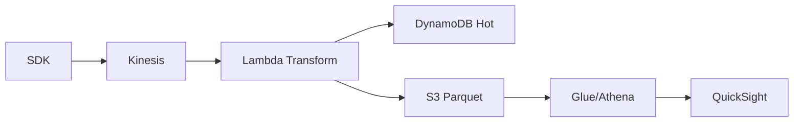

# File: docs/arch-pulsestream-analytics.md
---
title: Reference Architecture — PulseStream Real-Time Analytics
owner: data-platform@techco
status: draft
last-updated: 2025-07-05
tags: [Architecture, Kinesis, DynamoDB, Athena, QuickSight]
---

## Overview
PulseStream ingests product telemetry and powers real-time dashboards.

## Components
- **Kinesis Data Streams**: ingestion (1 MB records, 7-day retention).
- **Lambda**: transform/enrich → **DynamoDB** hot store (TTL 48h).
- **S3 (Data Lake)**: Parquet partitions (`dt=YYYY/MM/DD/HH`).
- **Glue Crawler & Athena**: ad-hoc SQL; **QuickSight** dashboards.
- **EventBridge**: anomaly alerts → PagerDuty.

## Diagram

## SLAs
- Event to dashboard P50 ≤ 90s.
- Data loss ≤ 0.01% (verified by sequence counters).

## Security
- All at-rest encrypted (KMS).
- Per-tenant partition key in DynamoDB and S3 prefixes.
