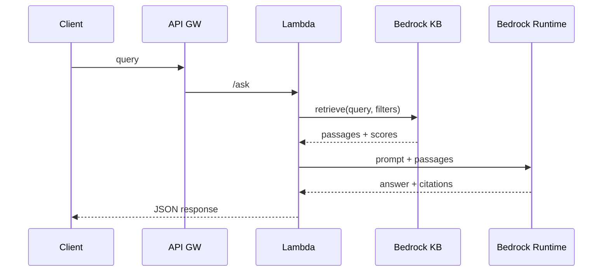

# File: docs/design-rag-nimbus-assist.md
---
title: Technical Design — Nimbus Assist RAG
owner: platform-ml@techco
status: review
last-updated: 2025-07-16
tags: [Design, RAG, Bedrock, OpenSearch, Lambda]
---

## Architecture
- **Data**: Authoritative docs in S3 (`s3://techco-knowledge/*`).
- **Index**: OpenSearch Serverless (vector + BM25) managed by Bedrock Knowledge Bases.
- **Embeddings**: `amazon.titan-embed-text-v2` (configurable).
- **Orchestration**: API Gateway → Lambda → Bedrock Runtime (retrieve + generate).
- **Storage**: DynamoDB for chat transcripts; S3 for feedback payloads.
- **Security**: IAM roles per environment; KMS CMKs; VPC endpoints for Bedrock/OpenSearch.

## Retrieval Parameters
- Chunk size: 1200–1800 tokens, overlap 150.
- Top-k: 8; hybrid rerank by score × recency (half-life 30 days).
- Filters: `product`, `version`, `complianceLevel`.

## Prompt Contract (abridged)
- System instructions enforce **“answer with citations, no speculation.”**
- Tool output schema: `{ answer, citations: [{title, uri, span}], safety }`.

## Flow

## Failure Modes & Mitigations
- Empty retrieval → fallback to “can’t answer” policy.
- Long contexts → dynamic top-k and passage truncation with budget 3500 tokens.
- Model timeout → cached last good answer (60m) if question hash matches.
